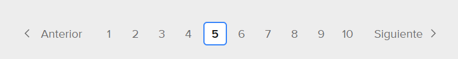

# Sistema de Planificación de Guardias Hospitalarias (NRP)

Repositorio oficial del Proyecto Final de Carrera (Grupo 7 - UTN FRCU).
Este sistema resuelve el problema de asignación de turnos (Nurse Rostering Problem) utilizando un Algoritmo Genético optimizado y una interfaz web para la gestión hospitalaria.

## 🏗 Arquitectura del Sistema

El proyecto utiliza una arquitectura de microservicios contenerizada:

1.  **Web App (`web_app`):** Aplicación MVC en **Django** (Interfaz de usuario y Gestión).
2.  **Motor de Optimización (`optimization_engine`):** API REST en **FastAPI** (Lógica del Algoritmo Genético).
3.  **Base de Datos (`db`):** Contenedor **PostgreSQL** persistente.

## 🚀 Despliegue Rápido (Recomendado)

Para levantar el sistema completo no necesitas instalar Python ni crear entornos virtuales. Solo necesitas **Docker Desktop**.

1.  **Clonar el repositorio:**
    ```bash
    git clone <URL_DEL_REPO>
    cd <NOMBRE_CARPETA>
    ```

2.  **Iniciar los servicios:**
    ```bash
    docker-compose up --build
    ```
    *La primera vez puede tardar unos minutos en descargar las imágenes y construir el entorno.*

3.  **Configuración Inicial (Solo la primera vez):**
    Abrí una nueva terminal en la carpeta del proyecto y ejecutá:
    ```bash
    # Crear las tablas en la Base de Datos
    docker-compose exec web python manage.py migrate

    # Crear usuario administrador para entrar al sistema
    docker-compose exec web python manage.py createsuperuser
    ```

---

## 🔗 Accesos y Credenciales

Una vez que la terminal muestra los logs de los servicios corriendo:

| Servicio | Dirección | Descripción |
| :--- | :--- | :--- |
| **Web App (Usuario)** | [http://localhost:8080](http://localhost:8080) | Login y Gestión de Turnos |
| **Panel Admin** | [http://localhost:8080/admin](http://localhost:8080/admin) | ABM de Médicos y Configuración |
| **Documentación API** | [http://localhost:8000/docs](http://localhost:8000/docs) | Swagger/Redoc del Algoritmo |

### 🛠 Acceso a Base de Datos (PgAdmin / DBeaver)
Si querés conectarte a la BD desde tu PC (externamente a Docker):
* **Host:** `localhost`
* **Puerto:** `5432`
* **Base de Datos:** `bd_hospital`
* **Usuario:** `admin`
* **Contraseña:** `admin`

## 📦 Comandos Útiles

* **Detener todo:** `Ctrl + C` en la terminal o `docker-compose down`.
* **Entrar a la consola del contenedor Django:**
    ```bash
    docker-compose exec web bash
    ```
* **Ver logs en tiempo real:** `docker-compose logs -f`.

* **Luego de hacer cambios, migrar para actualizar BD:**
    ```bash
    docker-compose exec web python manage.py makemigrations

    docker-compose exec web python manage.py migrate
    ```

---
**Desarrollado por:** Grupo 7 - Ingeniería en Sistemas de Información.